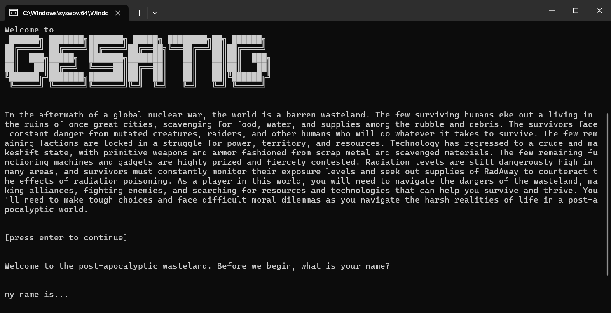

# Text Based Adventure Game



## Description
This is a text based adventure game where you can explore the wasteland. The game is written in Python. This project was made as a part of the course *programming 1* at NTI Gymnasiet Uppsala.

## Installation

### Prerequisites
- Python 3

### Instructions
1. Clone the repository
2. Run the game by executing the command:
```bash
python main.py
```

## Technologies
- Python
- JSON data storage